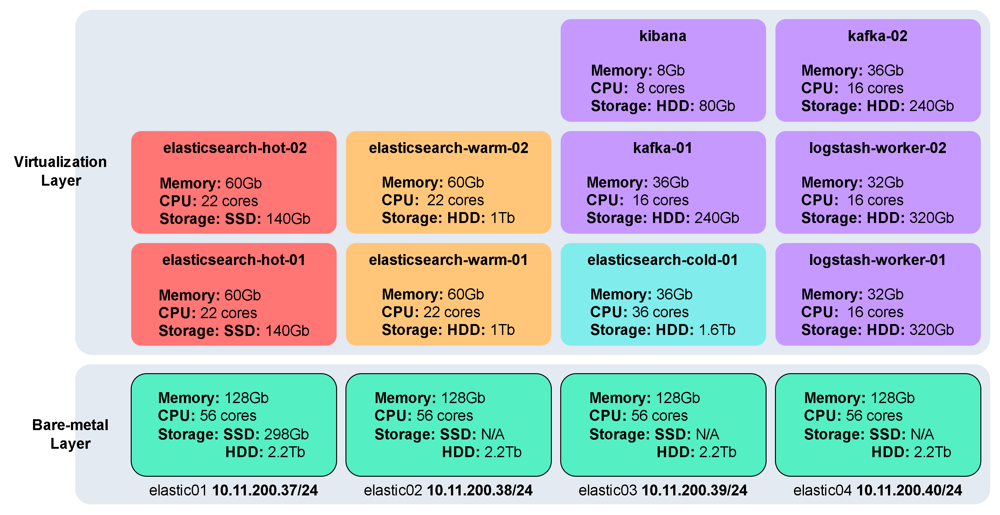

# creating elastic stack cluster with terraform

## architecture

we will use the ELK(Elasticsearch, Logstash, Kibana) stack to collect and store network logs in order to later apply machine learning algorithms to have better visibility and enhance network security.

we will deploy 5 storage nodes (Elasticsearch) following the Hot, warm, and cold data storage strategy which categorizes data based on access frequency (hot data being the most accessed and cold data the lease accesssed data), in this implementation hot data is stored on SSD drives and warm and cold data is stored on HDD drives.

we will also deploy 2 data processing nodes (Logstash), 2 messaging queues (Kafka) and one dashboard node (Kibana).

all the nodes will run on virtual machines using qemu and libvirt virtualization tools on top of linux (Ubuntu20.04) baremetal hosts as shown in figure 1




## perpare the host machines

install virtualization packages

```bash
sudo apt install virt-manager virt-top libguestfs-tools  -y
````

disable apparmor or selinux (depending on the linux distribution) for qemu.
even if selinux is not enforcing on the host machine it can still be enforcing inside the libvirt domain once terraform creates it and it causes permission errors when terraform tries to continue creating files inside the domain.

```bash
echo 'security_driver="none"' >> /etc/libvirt/qemu.conf
sudo systemctl restart libvirt-guests.service
sudo systemctl restart libvirtd.service
```

## install terraform on your workstation or laptop

```bash
wget -O- https://apt.releases.hashicorp.com/gpg | gpg --dearmor | sudo tee /usr/share/keyrings/hashicorp-archive-keyring.gpg

echo "deb [signed-by=/usr/share/keyrings/hashicorp-archive-keyring.gpg] https://apt.releases.hashicorp.com $(lsb_release -cs) main" | sudo tee /etc/apt/sources.list.d/hashicorp.list

sudo apt update && sudo apt install terraform
```

download and install the required terraform providers

```bash
mkdir -p $HOME/.local/share/terraform/plugins/registry.terraform.io/dmacvicar/libvirt/0.6.3/linux_amd64/

cd !$

wget https://github.com/dmacvicar/terraform-provider-libvirt/releases/download/v0.6.3/terraform-provider-libvirt-0.6.3+git.1604843676.67f4f2aa.Ubuntu_20.04.amd64.tar.gz
```

## create the infrastructure with terraform

```bash
terraform init #initialize terraform and get the required providers
terraform plan #check what will be applied this command will not create anything
terraform apply #create the infrastructure, you will be prompted for ssh passwords and to confirm the creation by typing 'yes'
```

if you encounter any errors or want to undo the `terraform apply` command run the following
it is important to run this command before you run `terraform apply` again.
```bash
terraform destroy #you will also be promted to confirm
````
